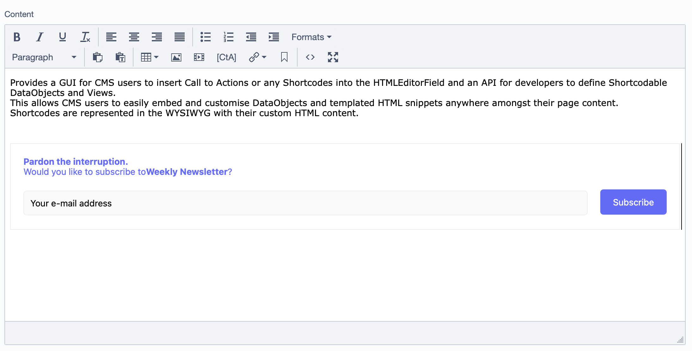
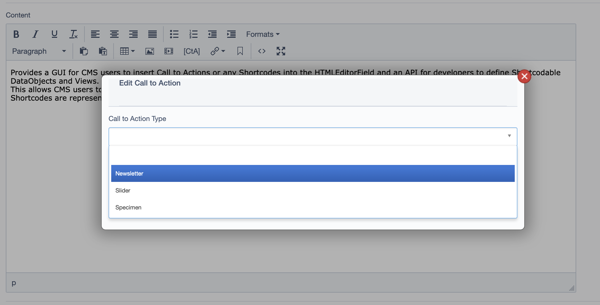
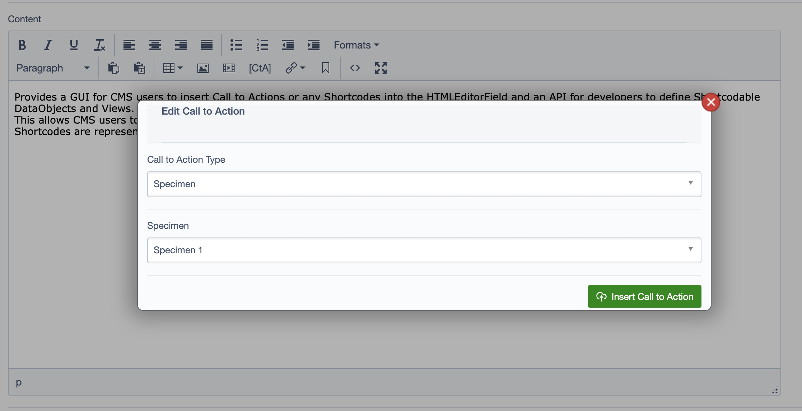

# SilverStripe 4 Call to Action

Provides a GUI for CMS users to insert Call to Actions or any Shortcodes into the HTMLEditorField and an API for developers to define Shortcodable DataObjects and Views. 
This allows CMS users to easily embed and customise DataObjects and templated HTML snippets anywhere amongst their page content. 
Shortcodes are represented in the WYSIWYG with their custom HTML content.

## Requirements
* SilverStripe 4 +

## Installation
Install via composer, run dev/build
```
composer require slonline/silverstripe-calltoaction
```

## Configuration
For adding your own Call To Action class, simply define a new class that can be derived from DataObject or ViewableData.
A class can implement ShortcodeableInterface interface. Interface defines required methods.
```phpt
class MyCallToAction extends ViewableData implements ShortcodeableInterface
{
    private static $singular_name = 'My Call To Action';
    private static $shortcode = 'mycta';
    
    public static function parse_shortcode($attributes, $content, $parser, $shortcode): string
    {
        return self::create()->renderWith(self::class);
    }
    
    public function getCallToActionPlaceHolder($attributes): string
    {
        return self::create()->renderWith(self::class);
    }
    
    public function singular_name()
    {
        $name = $this->config()->get('singular_name');
        if ($name) {
            return $name;
        }
        return ucwords(trim(strtolower(preg_replace(
            '/_?([A-Z])/',
            ' $1',
            ClassInfo::shortName($this)
        ))));
    }
    
    /**
     * Custom fields for Call To Action form
     *
     * @return FieldList
     */
    public function getShortcodeFields()
    {
        $fields = FieldList::create();
        ...
        return $fields;
    }
}
```
HTML will be rendered via a template.

Add a defined class in application config.
```yaml
Name: CallToActions
---
SLONline\CallToActions\CallToAction:
  calltoaction_classes:
    - MyCallToAction
```

#### TinyMCE block elements
In SilverStripe shortcodes tend to get wrapped in paragraph elements, which is a problem if your shortcode will be rendered as a block element. 
To get around this you can flag shortcodable classes as block elements with a config setting. If you don't want to replace the paragraph tag with a div this can be disabled as well.

```yml
MyCallToAction:
  shortcodable_is_block: true
  disable_wrapper: true
```
## Screenshots




## CMS Usage
Once installed a new button [CtA] will appear in the CMS HTMLEditor toolbar.

Clicking the toolbar will open a popup that allows you to insert a call to action or shortcode into the editor.

Highlighting an existing shortcode tag in the editor before clicking the shortcode icon will open the popup to allow editing of the selected shortcode tag.